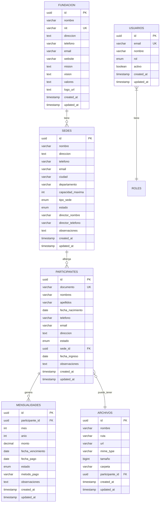

# Migración de Supabase a Spring Boot API


## 🔄 Cambios Realizados

### 1. **Nuevo Servicio API** ✅
- **Archivo**: `src/services/apiService.js`
- **Funcionalidad**: Cliente HTTP con Axios para comunicación con Spring Boot
- **Características**:
  - Interceptores para autenticación automática
  - Manejo centralizado de errores
  - Timeout y retry logic
  - Almacenamiento de tokens en localStorage

### 2. **AuthContext Actualizado** ✅
- **Archivo**: `src/components/Context/AuthContext.jsx`
- **Cambios**:
  - Reemplazado `supabase.auth` por `apiService`
  - Autenticación basada en JWT tokens
  - Manejo de sesiones con localStorage
  - Eliminada dependencia de Supabase Auth

### 3. **DatabaseService Refactorizado** ✅
- **Archivo**: `src/services/databaseService.js`
- **Cambios**:
  - Todas las funciones ahora usan `apiService`
  - Mantenida compatibilidad con componentes existentes
  - Eliminadas consultas directas a Supabase
  - Conservada estructura de respuesta `{ data, error }`

### 4. **Configuración de Entorno** ✅
- **Archivo**: `.env.example`
- **Cambios**:
  - Eliminadas variables de Supabase
  - Agregada `REACT_APP_API_BASE_URL` para Spring Boot
  - URL por defecto: `http://localhost:8080/api`

### 5. **Dependencias Limpiadas** ✅
- Eliminada `@supabase/supabase-js` del package.json
- Archivo `supabaseClient.js` respaldado como `.backup`
- Mantenida dependencia de `axios` para HTTP requests

## 🏗️ Estructura de la API Spring Boot Esperada

### Endpoints de Autenticación
```
POST /api/auth/login
POST /api/auth/logout  
POST /api/auth/reset-password
GET  /api/auth/me
```

### Endpoints de Datos
```
GET  /api/dashboard/stats
GET  /api/participantes
POST /api/participantes
PUT  /api/participantes/{id}
DELETE /api/participantes/{id}
GET  /api/mensualidades
POST /api/mensualidades
PUT  /api/mensualidades/{id}
GET  /api/sedes
GET  /api/health
```

### Endpoints de Archivos (Storage)
```
POST /api/files/upload
GET  /api/files?path={path}
DELETE /api/files/{encodedPath}
DELETE /api/files/folder/{encodedPath}
POST /api/files/folder
PUT  /api/files/folder/rename
GET  /api/files/download-url/{encodedPath}
```

## 🔐 Sistema de Autenticación

### JWT Token Flow
1. **Login**: `POST /api/auth/login` → Retorna `{ token, user }`
2. **Storage**: Token guardado en `localStorage`
3. **Headers**: Todas las requests incluyen `Authorization: Bearer {token}`
4. **Refresh**: Token validado en cada request
5. **Logout**: Token eliminado del localStorage

### Estructura del Usuario
```javascript
{
  id: number,
  nombre: string,
  email: string,
  rol: "ADMINISTRADOR" | "CONSULTA",
  created_at: string,
  updated_at: string
}
```

## 📊 Estructura de Respuestas

### Formato Estándar
```javascript
// Éxito
{ data: {...}, error: null }

// Error
{ data: null, error: { message: "Error description" } }
```

### Códigos de Estado HTTP
- `200`: Operación exitosa
- `201`: Recurso creado
- `400`: Error de validación
- `401`: No autorizado
- `403`: Sin permisos
- `404`: Recurso no encontrado
- `500`: Error interno del servidor

## 🚀 Configuración para Desarrollo

### 1. Variables de Entorno
Crear archivo `.env` en la raíz del proyecto basado en `.env.example`:
```bash
cp .env.example .env
```

Luego editar `.env` con la configuración correcta:
```bash
# Spring Boot API Configuration
REACT_APP_API_BASE_URL=http://localhost:8080/api

# Site Configuration for SEO
REACT_APP_SITE_URL=https://todoporunalma.org

# Analytics (Optional)
REACT_APP_GOOGLE_ANALYTICS_ID=
REACT_APP_FACEBOOK_PIXEL_ID=

# Social Media URLs
REACT_APP_FACEBOOK_URL=https://www.facebook.com/todoporunalma
REACT_APP_INSTAGRAM_URL=https://www.instagram.com/todoporunalma
REACT_APP_WHATSAPP_URL=https://wa.me/573104577835
```

### 2. Spring Boot Backend
Asegúrate de que tu API Spring Boot esté ejecutándose en:
- **URL**: `http://localhost:8080`
- **CORS**: Configurado para permitir `http://localhost:3001`
- **Headers**: Acepta `Content-Type: application/json`

### 3. Instalar Dependencias
```bash
npm install
```

### 4. Ejecutar Aplicación
```bash
npm start
```

## 🔧 Configuración de CORS en Spring Boot

```java
@Configuration
@EnableWebMvc
public class WebConfig implements WebMvcConfigurer {
    
    @Override
    public void addCorsMappings(CorsRegistry registry) {
        registry.addMapping("/api/**")
                .allowedOrigins("http://localhost:3001", "https://todoporunalma.org")
                .allowedMethods("GET", "POST", "PUT", "DELETE", "OPTIONS")
                .allowedHeaders("*")
                .allowCredentials(true);
    }
}
```

## 📝 Notas de Migración

### ✅ Funcionalidades Mantenidas
- Sistema de roles (ADMINISTRADOR, CONSULTA)
- Autenticación y autorización
- CRUD de participantes y mensualidades
- Dashboard con estadísticas
- Interfaz de usuario sin cambios

### 🔄 Cambios de Comportamiento
- Autenticación ahora usa JWT en lugar de Supabase Auth
- Tokens almacenados en localStorage en lugar de cookies
- Logout manual requerido (no automático)
- Validaciones del lado del servidor en Spring Boot

### 🚨 Consideraciones de Seguridad
- Tokens JWT deben tener expiración apropiada
- HTTPS requerido en producción
- Validación de entrada en el backend
- Rate limiting recomendado
- Logs de seguridad implementados

## 🐛 Troubleshooting

### Error: "Network Error"
- Verificar que Spring Boot esté ejecutándose
- Confirmar URL de la API en `.env`
- Revisar configuración de CORS

### Error: "401 Unauthorized"
- Token expirado o inválido
- Hacer logout y login nuevamente
- Verificar implementación de JWT en backend

### Error: "Failed to fetch"
- Problema de conectividad
- API no disponible
- Firewall bloqueando conexión

## 📚 Recursos Adicionales

- [Documentación de Axios](https://axios-http.com/)
- [JWT.io](https://jwt.io/) - Para debugging de tokens
- [Spring Boot CORS](https://spring.io/guides/gs/rest-service-cors/)
- [React Hook Form](https://react-hook-form.com/)

## 🗄️ Diseño de Base de Datos

### Diagrama de Entidades y Relaciones



### 📋 Estructura Detallada de Tablas

#### 1. **FUNDACION**
```sql
CREATE TABLE fundacion (
    id UUID PRIMARY KEY DEFAULT gen_random_uuid(),
    nombre VARCHAR(255) NOT NULL,
    nit VARCHAR(20) UNIQUE,
    direccion TEXT,
    telefono VARCHAR(20),
    email VARCHAR(100),
    website VARCHAR(255),
    mision TEXT,
    vision TEXT,
    valores TEXT,
    logo_url TEXT,
    created_at TIMESTAMP WITH TIME ZONE DEFAULT NOW(),
    updated_at TIMESTAMP WITH TIME ZONE DEFAULT NOW()
);
```

#### 2. **SEDES**
```sql
CREATE TABLE sedes (
    id UUID PRIMARY KEY DEFAULT gen_random_uuid(),
    nombre VARCHAR(255) NOT NULL,
    direccion TEXT NOT NULL,
    telefono VARCHAR(20),
    email VARCHAR(100),
    ciudad VARCHAR(100) NOT NULL,
    departamento VARCHAR(100) NOT NULL DEFAULT 'Antioquia',
    capacidad_maxima INTEGER DEFAULT 30,
    tipo_sede VARCHAR(20) DEFAULT 'MIXTA' 
        CHECK (tipo_sede IN ('MASCULINA', 'FEMENINA', 'MIXTA')),
    estado VARCHAR(20) DEFAULT 'ACTIVA' 
        CHECK (estado IN ('ACTIVA', 'INACTIVA', 'MANTENIMIENTO')),
    director_nombre VARCHAR(255),
    director_telefono VARCHAR(20),
    observaciones TEXT,
    created_at TIMESTAMP WITH TIME ZONE DEFAULT NOW(),
    updated_at TIMESTAMP WITH TIME ZONE DEFAULT NOW()
);
```

#### 3. **USUARIOS**
```sql
CREATE TABLE usuarios (
    id UUID PRIMARY KEY DEFAULT gen_random_uuid(),
    email VARCHAR(255) UNIQUE NOT NULL,
    nombre VARCHAR(255),
    password_hash VARCHAR(255) NOT NULL, -- Para Spring Security
    rol VARCHAR(20) DEFAULT 'CONSULTA' 
        CHECK (rol IN ('CONSULTA', 'ADMINISTRADOR')),
    activo BOOLEAN DEFAULT true,
    ultimo_acceso TIMESTAMP WITH TIME ZONE,
    created_at TIMESTAMP WITH TIME ZONE DEFAULT NOW(),
    updated_at TIMESTAMP WITH TIME ZONE DEFAULT NOW()
);
```

#### 4. **PARTICIPANTES**
```sql
CREATE TABLE participantes (
    id UUID PRIMARY KEY DEFAULT gen_random_uuid(),
    documento VARCHAR(20) UNIQUE NOT NULL,
    nombres VARCHAR(255) NOT NULL,
    apellidos VARCHAR(255) NOT NULL,
    fecha_nacimiento DATE,
    edad INTEGER GENERATED ALWAYS AS (
        EXTRACT(YEAR FROM AGE(fecha_nacimiento))
    ) STORED,
    telefono VARCHAR(20),
    email VARCHAR(100),
    direccion TEXT,
    estado VARCHAR(20) DEFAULT 'ACTIVO' 
        CHECK (estado IN ('ACTIVO', 'INACTIVO')),
    sede_id UUID REFERENCES sedes(id),
    fecha_ingreso DATE DEFAULT CURRENT_DATE,
    observaciones TEXT,
    created_at TIMESTAMP WITH TIME ZONE DEFAULT NOW(),
    updated_at TIMESTAMP WITH TIME ZONE DEFAULT NOW()
);
```

#### 5. **MENSUALIDADES**
```sql
CREATE TABLE mensualidades (
    id UUID PRIMARY KEY DEFAULT gen_random_uuid(),
    participante_id UUID REFERENCES participantes(id) ON DELETE CASCADE,
    mes INTEGER NOT NULL CHECK (mes BETWEEN 1 AND 12),
    anio INTEGER NOT NULL,
    monto DECIMAL(10,2) NOT NULL DEFAULT 0,
    fecha_vencimiento DATE,
    fecha_pago DATE,
    estado VARCHAR(20) DEFAULT 'PENDIENTE' 
        CHECK (estado IN ('PENDIENTE', 'PAGADA', 'VENCIDA')),
    metodo_pago VARCHAR(50),
    observaciones TEXT,
    created_at TIMESTAMP WITH TIME ZONE DEFAULT NOW(),
    updated_at TIMESTAMP WITH TIME ZONE DEFAULT NOW(),
    UNIQUE(participante_id, mes, anio)
);
```

#### 6. **ARCHIVOS** (Para gestión de documentos)
```sql
CREATE TABLE archivos (
    id UUID PRIMARY KEY DEFAULT gen_random_uuid(),
    nombre VARCHAR(255) NOT NULL,
    ruta VARCHAR(500) NOT NULL,
    url VARCHAR(500),
    mime_type VARCHAR(100),
    tamaño BIGINT,
    carpeta VARCHAR(255),
    participante_id UUID REFERENCES participantes(id),
    created_at TIMESTAMP WITH TIME ZONE DEFAULT NOW(),
    updated_at TIMESTAMP WITH TIME ZONE DEFAULT NOW()
);
```

### 🔗 Relaciones y Constraints

#### **Claves Foráneas:**
- `participantes.sede_id` → `sedes.id`
- `mensualidades.participante_id` → `participantes.id`
- `archivos.participante_id` → `participantes.id`

#### **Índices Recomendados:**
```sql
-- Índices para optimizar consultas frecuentes
CREATE INDEX idx_participantes_sede ON participantes(sede_id);
CREATE INDEX idx_participantes_estado ON participantes(estado);
CREATE INDEX idx_participantes_documento ON participantes(documento);
CREATE INDEX idx_mensualidades_participante ON mensualidades(participante_id);
CREATE INDEX idx_mensualidades_fecha ON mensualidades(mes, anio);
CREATE INDEX idx_mensualidades_estado ON mensualidades(estado);
CREATE INDEX idx_usuarios_email ON usuarios(email);
CREATE INDEX idx_archivos_participante ON archivos(participante_id);
```

#### **Triggers Útiles:**
```sql
-- Trigger para actualizar updated_at automáticamente
CREATE OR REPLACE FUNCTION update_updated_at_column()
RETURNS TRIGGER AS $$
BEGIN
    NEW.updated_at = NOW();
    RETURN NEW;
END;
$$ language 'plpgsql';

-- Aplicar trigger a todas las tablas
CREATE TRIGGER update_fundacion_updated_at BEFORE UPDATE ON fundacion 
    FOR EACH ROW EXECUTE FUNCTION update_updated_at_column();
CREATE TRIGGER update_sedes_updated_at BEFORE UPDATE ON sedes 
    FOR EACH ROW EXECUTE FUNCTION update_updated_at_column();
CREATE TRIGGER update_usuarios_updated_at BEFORE UPDATE ON usuarios 
    FOR EACH ROW EXECUTE FUNCTION update_updated_at_column();
CREATE TRIGGER update_participantes_updated_at BEFORE UPDATE ON participantes 
    FOR EACH ROW EXECUTE FUNCTION update_updated_at_column();
CREATE TRIGGER update_mensualidades_updated_at BEFORE UPDATE ON mensualidades 
    FOR EACH ROW EXECUTE FUNCTION update_updated_at_column();
```

### 📊 Datos Iniciales

#### **Fundación:**
```sql
INSERT INTO fundacion (nombre, nit, direccion, telefono, email, website, mision, vision) VALUES 
('Corporación Todo por un Alma', '900123456-7', 'Bello, Antioquia, Colombia', 
 '3145702708', 'info@todoporunalma.org', 'https://todoporunalma.org',
 'Brindar apoyo integral a personas en proceso de rehabilitación por adicciones',
 'Ser referente nacional en rehabilitación y reinserción social');
```

#### **Sedes:**
```sql
INSERT INTO sedes (nombre, direccion, ciudad, telefono, tipo_sede, director_nombre, director_telefono) VALUES 
('Sede Masculina Bello', 'Bello, Antioquia', 'Bello', '3145702708', 'MASCULINA', 
 'Dr. Juan Camilo Machado', '3145702708'),
('Sede Femenina Bello', 'Bello, Antioquia', 'Bello', '3216481687', 'FEMENINA', 
 'Dra. Mildrey Leonel Melo', '3216481687'),
('Sede Masculina Apartadó', 'Apartadó, Antioquia', 'Apartadó', '3104577835', 'MASCULINA', 
 'Martín Muñoz Pino', '3104577835'),
('Sede Femenina Apartadó', 'Apartadó, Antioquia', 'Apartadó', '3104577835', 'FEMENINA', 
 'Dra. Luz Yasmin Estrada', '3104577835');
```

#### **Usuario Administrador:**
```sql
-- Crear usuario administrador (password debe ser hasheada con BCrypt)
INSERT INTO usuarios (email, nombre, password_hash, rol) VALUES 
('admin@todoporunalma.org', 'Administrador', 
 '$2a$10$ejemplo.hash.bcrypt.password', 'ADMINISTRADOR');
```

### 🔍 Consultas Útiles para el Dashboard

#### **Estadísticas Generales:**
```sql
-- Dashboard stats
SELECT 
    (SELECT COUNT(*) FROM participantes WHERE estado = 'ACTIVO') as participantes_activos,
    (SELECT COUNT(*) FROM mensualidades WHERE estado = 'PAGADA') as mensualidades_pagadas,
    (SELECT COUNT(*) FROM mensualidades WHERE estado = 'PENDIENTE') as mensualidades_pendientes,
    (SELECT COUNT(*) FROM sedes WHERE estado = 'ACTIVA') as sedes_activas;
```

#### **Participantes con Sede:**
```sql
SELECT 
    p.id, p.nombres, p.apellidos, p.documento, p.telefono, p.estado,
    p.fecha_ingreso, s.nombre as sede_nombre, s.ciudad
FROM participantes p
LEFT JOIN sedes s ON p.sede_id = s.id
ORDER BY p.created_at DESC;
```

#### **Mensualidades con Participante:**
```sql
SELECT 
    m.id, m.mes, m.anio, m.monto, m.estado, m.fecha_pago,
    CONCAT(p.nombres, ' ', p.apellidos) as participante_nombre,
    s.nombre as sede_nombre
FROM mensualidades m
JOIN participantes p ON m.participante_id = p.id
LEFT JOIN sedes s ON p.sede_id = s.id
ORDER BY m.anio DESC, m.mes DESC;
```

---

**Fecha de Migración**: 2025-01-19  
**Versión**: 1.0.0  
**Estado**: ✅ Completado
